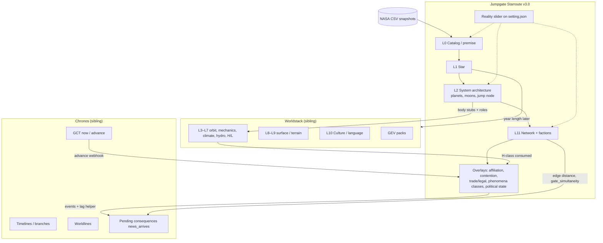
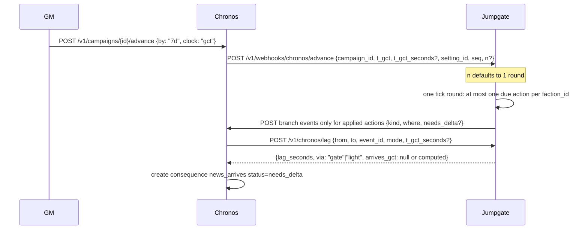
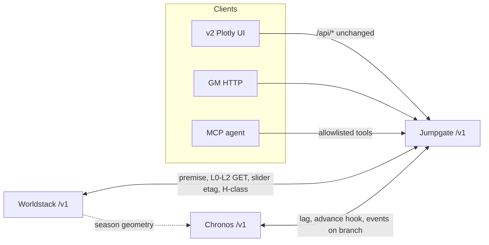

# Jumpgate Starroute v3.0 — Design Document

| Field | Value |
|---|---|
| **Title** | Ptah (Jumpgate Starroute) v3.0: Worldstack layer provider, public HTTP/MCP, politics, phenomena, Chronos peer |
| **Working name** | **Ptah** (Egyptian craftsman-creator). GitHub remains `jumpgate_starroute` until a rename. |
| **Author** | TBD (draft for review) |
| **Date** | 2026-09-12 |
| **Status** | Draft (revised after review 2026-09-12; Ptah + camera handoff 2026-09-12) |
| **Product version** | **3.0** (not 2.5). New public contract. Mapgen engine from v2.0 may stay. |
| **Current code** | `jumpgate_starroute` v2.0.0 (`starroute/__init__.py`, FastAPI `starroute/web/app.py`) |
| **Siblings** | Worldstack (L3–L10 + GEV packs); Chronos (campaign chronology); God’s Eye View (Earth through GEO). |
| **UI** | Keep the existing Plotly / drawer UI for standalone use and hands-on generate (human or agent). |

---

## Overview

Jumpgate Starroute v2.0 is a local GM tool: NASA `PSCompPars` + `STELLARHOSTS` → one row per host in `data/processed/systems.csv` → a Sol-rooted KD-tree jump graph (`starroute/mapgen/network.py`) → species/nation assignment (`starroute/mapgen/factions.py`) → Plotly map and a `"starroute": "2.0"` snapshot. Public routes live under `/api/*` and are file-coupled to those CSVs. There is no setting document, no provenance mix, no per-planet JSON, no political state machine, and no calendar peer.

v3.0 keeps the mapgen engine (cKDTree neighbor search, jump bands as **percent of max hop**, composite ranking, optional Pyodide) and the v2 UI on `/api/*`. It adds a **new product contract**: JSON documents as canonical store; a **setting** as source of truth; a **shared reality slider** (0–4 provenance mix); Worldstack **layer-provider** ownership of L0, L1, L2, L11 plus overlays; public **`/v1` HTTP** (and 1:1 MCP); **politics/trade/legal overlays + a living stepper that does not own calendars**; **phenomena as hazard classes and event templates**; and a **Chronos** peer for GCT, news-lag pending consequences, and `advance`. Chronos remains a separate layer-provider project. Jumpgate never duplicates `/v1/calendars`, worldlines, or branches.

### Cameras and scale (GEV vs Ptah vs Stellarium)

Do **not** one-zoom Cesium from street → GEO → heliosphere → 60 ly. Meters and light-years do not share a camera (Worldstack locked decision 5). God’s Eye View is a Cesium **Earth** globe with live OSINT and satellites; GEO (~42 164 km) is still WGS84 meters. Cesium can be forced to solar-system distances only by hacking the far plane, and then depth precision and Earth 3D tiles fall apart.

| Band | Owner | Geometry | Viewer |
|---|---|---|---|
| Surface → geosynchronous (Earth) | God’s Eye View | meters, WGS84 | Cesium GEV (unchanged, not forked) |
| Cislunar / Moon | GEV if it stays meters; else later | meters | Optional GEV Moon; **not** v3.0 Ptah |
| One star + planets (AU) | **Ptah** L2 documents; Worldstack L3–L9 | AU | Ptah system card / later pack; **not** GEV zoom-out |
| Jump network (ly) | **Ptah** L11 | light-years, Cartesian origin Sol | Existing Plotly map (`starroute/web`) |

**Stellarium** is a future **export**, not a v3.0 viewer. It already has an Exoplanets plugin (host stars on *our* sky) and user `ssystem_*.ini` Kepler objects. Emitting a one-system INI pack from L2/L3 is feasible later. Replacing Hipparcos with a setting sky, or drawing jump lanes, is a different project (Celestia STC/SSC is actually closer for visiting other systems). Wait until `/v1` documents exist.

**UI stays.** `/api/*` + Plotly drawer remain for humans and for agents that want a hands-on generate loop. `/v1` is additional, not a replacement.

---

## Background & Motivation

### Current state (v2.0, `main`)

| Piece | Location | Behavior |
|---|---|---|
| HTTP UI | `starroute/web/app.py` `create_app()` | FastAPI 2.0.0; `/`, `/api/status`, ingest, factions, network generate/snapshot/path, `/api/download/{name}` |
| Ingest | `starroute/ingest/pipeline.py` | `HOST_KEEP` / `PLANET_KEEP`; `classify_planets`; Sol insert; recenter XYZ; write `systems.csv` |
| Classify | `starroute/ingest/classify.py` | Rocky/gas/ice density cuts; carbon/sulfur/silicon **eqt bands as setting convention** |
| Network | `starroute/mapgen/network.py` | `DEFAULT_NETWORK`, `_band_limits`, `generate_network`, `shortest_path`, `network_payload` |
| Factions | `starroute/mapgen/factions.py` + `config/factions.json` | Exclusive claim per host (`Species`/`Nation`/`Group`); MST route trees; hubs |
| WASM | `WASM.md`, `starroute/web/static/` | Generate from `sample-systems.csv`; NASA ingest tab grayed |
| Tests | none | No `tests/` tree |

Pain points that v3.0 is for:

1. **CSV is the model.** `systems.csv` flattens planets into host flags. Worldstack needs per-body L2 lists and provenance. Agents cannot safely write NASA CSVs.
2. **One exclusive faction per host.** Overlap exists only as Human rocky vs Kessari sulfur in the 60 ly preview, not as controlling vs present with influence shares.
3. **No setting, no slider.** Ingest always invents nothing and never mutates NASA nulls — which is slider 0 — but there is no way to gap-fill moons or add fiction without silently lying.
4. **No time peer.** A living political map without GCT will grow an ad-hoc clock. Chronos already specifies two clocks and a news-lag helper that **asks Jumpgate** for edge distance and gate simultaneity.
5. **`/api/*` is UI-shaped.** Worldstack’s sketch (`POST /v1/ingest/nasa`, `GET /v1/systems/{id}`, …) cannot mount on the current routes without a versioned façade.

Worldstack’s brief already names Jumpgate as owner of L0 (partial), L1, L2 (system list), L11. This document **locks that ownership** and extends it with overlays, while Worldstack remains sibling for L3–L10 and GEV packs.

---

## Goals & Non-Goals

### Goals (v3.0)

- Ship a **public `/v1` HTTP API** with OpenAPI 3, explicit `operationId`s, RFC 7807 errors; keep `/api/*` working for the v2 UI.
- Canonical **JSON documents** per setting/system/body(L2)/network/faction/overlay; CSV as export; optional SQLite index later.
- **Reality slider 0–4** as a provenance mix, shared with Worldstack via a setting document (**strong etag compare-and-swap**, not last-write-wins).
- **Layer provider** for Worldstack L0, L1, L2, L11 + overlays (affiliation/contention, trade/legal, phenomena *classes*, political state).
- **Politics**: overlay tables **and** a living stepper. Chronos owns calendars/`now`/`advance`.
- **Phenomena**: hazard classes + event catalog templates on stars/systems. Dated instances and news-lag → Chronos.
- **MCP**: thin allowlisted adapter; tools 1:1 with `/v1` `operationId`s; agents never write NASA CSVs.
- **Chronos peer**: lag helper, gate simultaneity default `true`, event source, optional local tick for demos.
- Concrete **pytest** coverage listed in this doc.

### Non-goals (v3.0)

- Implementing Chronos or Worldstack L3–L10 / GEV packs in this repo.
- Duplicating Chronos APIs (`/v1/calendars`, worldlines, branches, `advance`).
- Computing visitability H0–H6 or native L-scale (consume Worldstack H-class if present).
- Language / culture generation (Worldstack L10).
- Cloning Traveller UWP as the core model, SWN faction-turn rules, or Elite daily BGS ticks.
- Climate GCM, n-body ephemerides, Cesium interstellar map.
- Forking God’s Eye View.
- Rewriting mapgen in a new language; Pyodide remains optional.
- Multi-tenant cloud auth (local-first; optional loopback bearer only).
- Dated phenomena instances, player fog-of-war, generated census as first-class numbers.

---

## Key Decisions

Architectural decisions locked for v3.0. Changing one requires a schema bump (`jumpgate.*.v1` → `v2`) and a HISTORY.md section.

| ID | Decision | Rationale |
|---|---|---|
| **K1** | Product version is **3.0**, not 2.5. Snapshot field stays `"starroute": "2.0"` until a dedicated WASM PR; public API is `/v1` regardless. | New contract (settings, slider, overlays, Chronos, MCP) is not a patch on the CSV UI. Mapgen math can stay. |
| **K2** | Jumpgate **owns** Worldstack **L0, L1, L2, L11** plus overlays listed below. Worldstack owns **L3–L10** and GEV packs. | Matches Worldstack §2 / §11; avoids two writers of host XYZ and jump graphs. |
| **K3** | JSON documents are canonical. `systems.csv` / `sol_network.csv` become **export views**. Optional SQLite is an index, never source of truth. | Aligns with Worldstack §4 and Chronos §10; agents and etags need documents. |
| **K4** | **Setting document** (Jumpgate store) is the sole source of truth for the reality slider. Either Jumpgate or Worldstack may `GET`/`PUT /v1/settings/{id}/reality`. **Compare-and-swap via strong If-Match**; 412 if the header is missing, 409 + current document if mismatch. **No silent overwrite. Not last-write-wins.** Weak tags (`W/"…"`) are rejected (412). **Etag digest excludes `etag` and `updated_at`** (store attribute, echoed on GET; see §2). Chronos may **read** `setting_id` + `now`; it does not own the slider. `updated_by=chronos` → **403**. Worldstack may **cache** `reality`+etag; the cache is not SoT — every write is GET then PUT to Jumpgate with If-Match. | Prevents dual clocks of “how fictional is this map.” RFC 9110 If-Match is strong comparison. Hashing a document that contains its own digest is circular. |
| **K5** | Reality slider is a **provenance mix**, integer 0–4, semantics in §Proposed Design. Code must refuse operations illegal at the current stop (409 `reality_forbidden`). Stops 2–4 have **explicit write APIs** (`put_override`, `put_extra_edge`, `create_generated_host`, `put_xyz`). | “Generated moon” vs “moved star” are different lies; a boolean `fiction` is not enough. |
| **K6** | Politics = **overlay tables + living stepper**. Jumpgate stores political *state* and emits/consumes *events*. **Do not own calendars.** Chronos stores GCT, calendars, timelines, branches, worldlines, pending consequences. | Avoids a third campaign clock (Chronos D1). |
| **K7** | Phenomena in Jumpgate = **hazard classes + event catalog templates** attached to stars/systems. Dated instances, visibility, `news_arrives` lag → Chronos. **Sneak attacks are political events**, not natural phenomena. | Natural vs sentient split matches Chronos §5. |
| **K8** | `POST /v1/settings/{id}/tick` is **not** a calendar advance. HTTP **`n` = number of tick rounds** (default **1**), not queue pops. Each round pops **at most one due action per `faction_id`** (FIFO; `horizon_ly` / `faction_id` filter still apply). Two factions with queued actions both fire in one `n=1` round; same-faction items stay FIFO across rounds. Preferred trigger: Chronos `advance` webhook — **one round (`n=1`) unless Chronos sends `n`**. Empty queue → **no-op**; **never invent** raids. Duplicate `last_tick_seq` / same `t_gct` → no-op. Stamp `t_gct` only if Chronos URL configured. Default `POST .../actions` is **enqueue only** (no contention change, no Chronos draft until apply). | Keeps `now` in one place; stepper is deterministic; no `n` fork. |
| **K9** | Default campaign rule **`gate_simultaneity: true`**. **Jumpgate setting is authoritative for gate fiction.** When a Chronos `campaign_id` is linked, Chronos **copies** this flag onto the campaign and **must not invent a second default**. Dilation is for torchships (Chronos worldline `gamma`), not gates. Jumpgate does not compute proper time. | Chronos open question; jump-gate fiction; avoids dual defaults. |
| **K10** | HTTP `/v1` is source of truth for agents. MCP is a **thin adapter over the v1 sub-app only**, constructed with `include_operations=ALLOWLIST` (never unfiltered on `create_app()`). Tool name = `operationId`. Agents **never** write NASA CSVs. Ingest tools take **paths already on disk** or a catalog snapshot id. MCP ships **after** all `/v1` routes exist. | Worldstack §11.8; FastAPI-MCP filtering; upload lives on `/api` and must not become a tool. |
| **K11** | **Dual identity.** Canonical v3 `id` = slug of NASA `hostname` (`hostname.lower()`, `[^a-z0-9]+` → `-`, strip `-`). Display name and **v2 graph keys remain NASA `hostname`** (`AU Mic`, `55 Cnc B`, spaces preserved). Every v3 node/system carries **both** `id` and `hostname`. v2 `network_payload` **must not** replace `hostname` / `a` / `b` with slugs. Route, lag, search, and path parameters accept **either** form; `resolve_host(setting_id, token)` tries exact `hostname` then slug. Two hostnames that slug-collide → ingest 409 `id_collision`. Binaries with separate NASA rows stay separate hosts. Jump **node** is a tagged child, not a second host. | `shortest_path` / Plotly `lookup[edge.a]` are hostname-keyed (`network.py`, `app.js`). Slug-only `/v1` would drop every v2 edge. |
| **K12** | v2 `/api/*` remains on the **UI app**. `/v1` is a **mounted child FastAPI app** (own OpenAPI, own RFC 7807 handlers, MCP only there). No calendar routes in Jumpgate OpenAPI (`/v1/openapi.json`). FastAPI/OpenAPI `version` and `starroute.__version__` become **3.0.0** when `/v1` ships; snapshot envelope stays `"starroute": "2.0"` until the WASM PR. | UI compatibility; RFC 7807 must not wrap `data.detail` for Plotly. |
| **K13** | Affiliation is **many-per-system**: `controlling` (0..1) + `present[]` with optional `influence` shares summing to 1 when present. Exclusive `Species`/`Nation` on the CSV is a **legacy export view** (controlling faction only). | Elite-style structure without daily ticks. |
| **K14** | Legal schedule is **per faction**, not per system: goods/actions → `free \| taxed \| permit \| banned` + fee/tariff. **v3.0 system legality = controlling faction’s schedule only.** Per-facility / present-faction legal overrides are **out** (v3.1). | Government drives legality; contention drives travel advisories. Do not specify an unstoreable override. |
| **K15** | Lag helper **always** returns `lag_seconds`, `via`, and identity fields. `arrives_gct` is set **only** when the caller supplies `t_gct_seconds` (SI); `t_gct` is an opaque string and is never added to. Algorithms: `mode=light` → Euclidean `\|xyz_a−xyz_b\| / c` (404 only if a host is missing); `mode=gate` → hop-count BFS on gate-flavored edges, `lag_seconds = n_jumps * gate_handling_seconds`, 404 `no_route` if none; `mode=auto` → gate if a gate path exists and `gate_simultaneity` else light. Intel fog is Chronos `news_arrives` + visibility. | Chronos peer table; Jumpgate does not own GCT formatters. |
| **K16** | Faction `id` = slug of current `config/factions.json` `name` (same function as K11). Optional `chronos_ref` (e.g. `"faction.turquenish"`) for Chronos `actors[]`. Seed overlays from `assign_factions` `Group` via that slug. Do not use `faction.` prefixes as Jumpgate primary keys. | Live config has display names only; Chronos brief uses `faction.kessari`. |
| **K17** | List/search/tick/rebuild/affiliations/exports that read setting-scoped data require `setting_id` (path or query). **400** `missing_setting_id` if omitted and more than one setting exists; if exactly one setting, default to it. | Settings are the unit of collaboration; hosts may be shared, overlays are not. |
| **K18** | v2 `network_payload` is **additive-only**: may gain `band`, `flavor`; **never** rename `distance`, `a`, `b`, or node `hostname`. v3 network documents use `distance_ly` plus `id`/`hostname`. Mapping is explicit in the v2→v3 table. | `app.js` `lookup[edge.a]` and snapshots (`default-map.js`) key on hostname + `distance`. |
| **K19** | v3.0 **embargo does not remove or reverse edges.** It raises the contention floor (matrix in §6.3) and writes legal `banned` on listed goods. `avoid=denied` on route is advisory. Directed blockades are **v3.1**. | `network_payload` undirected `tuple(sorted((src,dest)))`; do not pretend embargo is pathfinding. |
| **K20** | `/v1` rebuild defaults merge `DEFAULT_NETWORK` **with** `config/network.json` (shipped 25 ly / 40% / 60% / 80 nodes), **not** `NetworkRequest` Pydantic field defaults (50 / 50 / 75 / 101). | Those Pydantic defaults predate the 60 ly preview; the UI today sends form values so `/api` is safe. |
| **K21** | `GET /v1/bodies/{id}` always returns Jumpgate’s **L2 stub**. If Worldstack has L3+, include `worldstack_url` (absolute URL to Worldstack’s body document). **Never 303.** **Never fetch or embed** climate, visitability, or other L3–L10 fields. | One body reader; Worldstack remains the climate/H-class owner. Jumpgate is not a proxy. |
| **K22** | v3.0 **trade overlay is queryable tariffs/practices only.** `composite_ranking` stays carbon/sulfur/silicon + stability (`starroute/mapgen/ranking.py`). Do **not** fold trade weights or H-class into ranking until Worldstack L7 exists. Visitability-weighted hubs are later. | H-class is Worldstack L7; Jumpgate must not invent it to score hubs. |

---

## Proposed Design

### 1. Layer map (Worldstack)

Jumpgate is a **layer provider**: it serves documents whose `layer` field is `L0|L1|L2|L11` or `overlay.*`. Worldstack must not regenerate those layers; it may **pin premises** via `POST /v1/systems/{id}/premise` and then generate L3–L10 itself.



**What Jumpgate writes vs what it only stores as a stub**

| Object | Jumpgate | Worldstack |
|---|---|---|
| Host row, RA/Dec, XYZ, spectype, mass | **Writes** (L1) | Reads |
| Confirmed planets (`pl_name`, mass, radius, eqt, a) | **Writes** L2 list | Reads; fills L3–L7 |
| Generated moons/giants at slider ≥1 | **Writes** L2 with `source.kind=generated` | May generate L3–L7 from that body |
| Jump graph, bands, ranking | **Writes** L11 | Rebuild via Jumpgate |
| Visitability H-class | **Consumes** if present on body | **Writes** L7 |
| Language | Out of scope | L10 |
| GEV pack | Out of scope | Packs |

### 2. Setting + reality slider protocol

A **setting** is the unit of collaboration. One setting has one catalog snapshot ref, one origin host, one network id, one reality stop, optional Chronos campaign id.

```json
{
  "schema": "jumpgate.setting.v1",
  "id": "iron-ash",
  "title": "Iron Ash",
  "etag": "\"sha256-3b7f9c12a4d0\"",
  "updated_at": "2026-09-12T18:00:00Z",
  "updated_by": "jumpgate",
  "reality": 1,
  "origin_hostname": "Sol",
  "catalog": {
    "planets_snapshot": "PSCompPars_2026.08.08_21.51.22",
    "hosts_snapshot": "STELLARHOSTS_2026.08.08_22.00.33"
  },
  "network_id": "iron-ash-net",
  "chronos": {
    "campaign_id": "campaign-iron-ash",
    "base_url": "http://127.0.0.1:8060",
    "gate_simultaneity": true,
    "gate_handling_seconds": 0
  },
  "owners": ["jumpgate", "worldstack"]
}
```

**Ownership protocol (slider) — compare-and-swap, not LWW**

1. Setting JSON lives only in Jumpgate’s store (`data/jumpgate/settings/{id}.json`). Jumpgate is the NASA/network process. Worldstack may **cache** `reality` + `etag` as a pointer; that cache is **not** source of truth and must not be PUT locally.
2. `GET /v1/settings/{id}/reality` returns `{reality, etag, updated_at, updated_by}`. `etag` is a **strong store attribute**, not an input to its own digest:
   - Canonical bytes = RFC 8785 JCS (fallback: UTF-8 JSON, keys sorted, no insignificant whitespace) of the setting object **with `etag` and `updated_at` removed**.
   - `etag = "\"" + "sha256-" + sha256(canonical_bytes).hexdigest()[:12] + "\""` (quoted strong tag; no `W/`).
   - Persist the tag as store metadata and **echo** it on GET/PUT. The on-disk JSON may contain `"etag"` for humans; the hasher **always strips** `etag` and `updated_at` first. Flipping only `etag` in the file does not change the computed tag.
   - **Exclude `updated_at`:** a timestamp rewrite must not mint a new CAS token when hashed fields (`reality`, `updated_by`, catalog refs, …) are unchanged. Include `updated_by` so a different actor’s PUT still changes the tag if other fields match.
   - Compare If-Match as raw header bytes against the stored attribute.
3. `PUT` **requires** `If-Match: "sha256-…"`. Body `{ "reality": 2, "updated_by": "worldstack" }`. Missing header → **412** `precondition_required`. Header starting with `W/` → **412** `weak_etag`. Byte mismatch → **409** `etag_mismatch` with the current document (client must GET and retry). Success writes the new content, sets `updated_at`, and stores the **recomputed** strong etag (same body-minus-etag/`updated_at` ⇒ same tag).
4. `updated_by` is `jumpgate | worldstack | agent`. Value `chronos` → **403** `forbidden_actor` even in local-first (Chronos is a consumer).
5. Raising the slider is always allowed. **Lowering** is allowed only if no documents exist whose `source.kind` or `overrides[]` would be illegal at the new stop, **or** the client sends `discard_illegal: true` (explicit). Otherwise **409** `reality_conflict` listing offending ids. Hiding generated hosts without discard is **not** a v3.0 feature (Open Question 4 stays closed as 409-or-discard).
6. Chronos may GET `setting_id` and `reality` for flavor. It **must not** PUT the slider.

**Slider stops**

| Stop | Name | May invent bodies | Mutate confirmed rows | New hosts | Move XYZ | Invent routes/factions |
|---|---|---|---|---|---|---|
| **0** Catalog | No invented bodies; NASA nulls stay null | no | no | no | no | no (graph from catalog hosts only) |
| **1** Gap-fill | Invent bodies tagged `source.kind=generated` | yes (tagged) | no | no | no | no extra hosts; routes among catalog hosts |
| **2** Soft fiction | `overrides[]` with originals preserved | no new unlabeled | via override, original kept | no | no | fiction on existing hosts |
| **3** Setting-scale | Invent routes/factions | yes | via override | **no** | no | **yes** |
| **4** Procedural | Full procedural | yes | yes (override) | **yes** | **yes** | yes |

Invariants and **write APIs** (tests call these; 409 `reality_forbidden` below the stop):

- Stop 0: `POST /v1/systems/{id}/premise` with `need: warehouse_moon` **fails**. NASA `pl_eqt` null stays null (do not fill from a–L). No overrides, extra edges, generated hosts, or xyz writes.
- Stop 1: `POST .../generate-l2` / premise gap-fill. One **stub body** per unsatisfied `need` role. Confirmed **body** JSON byte-equal; system envelope `bodies[]` **append-only**.
- Stop 2: `PUT /v1/systems/{id}/overrides` (`put_override`). Body `{path, from, to, reason}`. GET effective view; `?view=catalog` returns originals. No new hosts, no xyz moves, no unlabeled bodies.
- Stop 3: `PUT /v1/networks/{id}/edges/{a}/{b}` (`put_extra_edge`) among **catalog** hosts (`source.kind=setting_edge`). Faction overlays OK. `create_generated_host` / `put_xyz` → 409.
- Stop 4: `POST /v1/systems` (`create_generated_host`) and `PUT /v1/systems/{id}/xyz` (`put_xyz`). Audit jsonl on each.

`rebuild_network` always re-runs the KD-tree among allowed hosts; it is **not** the extra-edge write path. Extra edges persist across rebuild when `preserve_overlays: true` (default).

### 3. Storage layout

```
data/jumpgate/
  settings/{setting_id}.json
  catalogs/{snapshot_id}.json          # ingest provenance, not the 100 MB CSV
  systems/{system_id}.json             # L0+L1+L2 refs
  bodies/{body_id}.json                # L2 only (not climate)
  premises/{premise_id}.json
  networks/{network_id}.json           # graph
  networks/{network_id}.trade.json     # overlay
  factions/{faction_id}.json
  overlays/{setting_id}/affiliations.json
  overlays/{setting_id}/politics.json  # contention, influence, stepper cursor
  overlays/{setting_id}/legal/{faction_id}.json
  phenomena/classes.json
  phenomena/templates.json
  audits/{setting_id}/{iso}.jsonl
data/processed/                        # CSV exports + v2 compatibility
  systems.csv
  sol_network.csv
  ...
data/raw/                              # NASA snapshots, gitignored, human/CLI only
```

Keep writing v2 CSVs on ingest/rebuild so `/api/network` and the Plotly viewer still work.

### 3.1 Dual identity (`hostname` vs `id`)

```python
def host_id(hostname: str) -> str:
    slug = re.sub(r"[^a-z0-9]+", "-", hostname.lower()).strip("-")
    return slug  # "AU Mic" → "au-mic"; "55 Cnc B" → "55-cnc-b"; "Sol" → "sol"

def resolve_host(setting_id: str, token: str) -> System:
    """Accept NASA hostname or v3 slug. Prefer exact hostname, then unique slug."""
```

| Surface | Node / edge keys | Path list |
|---|---|---|
| v2 `GET /api/network` `network_payload` | `nodes[].hostname`; `edges[].a` / `b` = **hostname**; `distance` (ly) | n/a |
| v2 `POST /api/network/path` | `start`/`end`/`path[]` = **hostname** | hostnames |
| v3 `jumpgate.network.v1` / `jumpgate.system.v1` | `id` slug **and** `hostname`; edges `a`/`b` = **id**; `a_hostname`/`b_hostname`; `distance_ly` | `path_ids` + `path_hostnames` |
| v3 route/lag/search query params | either form | both arrays in the body |

`app.js` `shortestPathLocal` / `drawMap` do `lookup[edge.a]` against `n.hostname`. If `/api/network` ever emitted slugs in `a`/`b`, every edge would silently drop. **PR 7 must not change those keys.**

Golden tests: `/api/network` edge `a`/`b` still match hostnames in the live CSV / `default-map.js`; `GET /v1/networks/{id}/route?setting_id=&start=AU%20Mic` equals `...?start=au-mic` (same `path_ids`).

### 4. Document shapes (L0–L2, L11)

**System (L0+L1 envelope)** — lift of one `systems.csv` row:

```json
{
  "schema": "jumpgate.system.v1",
  "layer": ["L0", "L1", "L2"],
  "id": "au-mic",
  "hostname": "AU Mic",
  "setting_id": "iron-ash",
  "source": {
    "kind": "nasa",
    "snapshot": "STELLARHOSTS_2026.08.08_22.00.33",
    "manual_entry": false
  },
  "star": {
    "st_spectype": "M1 V",
    "st_teff": 3540.0,
    "st_mass": 0.635,
    "st_rad": 0.862,
    "st_lum": -0.97757,
    "st_age": 0.019,
    "st_rotp": 4.86,
    "st_met": 0.01,
    "sy_snum": 1.0,
    "cb_flag": 0
  },
  "coords": {
    "ra": 311.2911369,
    "dec": -31.34245,
    "sy_dist_pc": 9.7221,
    "distance_from_sol_ly": 31.709212476,
    "xyz_ly": [17.871, -20.349, -16.494],
    "origin_hostname": "Sol"
  },
  "flags": {
    "rocky_count": 0,
    "gas_giant_count": 1,
    "stability_score": 2
  },
  "bodies": ["au-mic.b", "au-mic.c"],
  "jump_nodes": [
    { "id": "au-mic.gate", "kind": "gate", "site": "lagrange", "flavor": "gate" }
  ],
  "roles_stub": [],
  "overrides": [],
  "hazards": ["flare:M_active"]
}
```

**Body (L2 only)** from `PLANET_KEEP` (`pl_name`, `pl_letter`, `pl_bmasse`, `pl_rade`, `pl_eqt`, `pl_orbsmax`). Fixture tests **copy real snapshot values**; do not invent all-nulls unless that NASA row is null.

```json
{
  "schema": "jumpgate.body.v1",
  "layer": "L2",
  "id": "au-mic.b",
  "host_id": "au-mic",
  "pl_name": "AU Mic b",
  "source": { "kind": "nasa", "snapshot": "PSCompPars_2026.08.08_21.51.22" },
  "pl_letter": "b",
  "pl_bmasse": null,
  "pl_rade": null,
  "pl_eqt": null,
  "pl_orbsmax": null,
  "class_guess": "unknown",
  "role": null,
  "worldstack_url": null
}
```

At slider 0, NASA nulls stay null. Classification (`rocky/gas/ice`) remains the v2 heuristic in `classify_planets` when mass+radius exist; it is a **flag**, not an L4 mass model.

**Slider 1 generated stub** (Jumpgate does **not** compute `g`, orbit, or climate — Worldstack L3–L4 fills):

```json
{
  "schema": "jumpgate.body.v1",
  "layer": "L2",
  "id": "gj-667-c.gen-moon-1",
  "host_id": "gj-667-c",
  "pl_name": null,
  "source": { "kind": "generated", "seed": "ws-gj-667-c-0001" },
  "role": "warehouse_moon",
  "tags": [],
  "g_earth_max": 0.25,
  "pl_bmasse": null,
  "pl_rade": null,
  "pl_eqt": null,
  "pl_orbsmax": null,
  "worldstack_url": null
}
```

Gap-fill algorithm (`generate_l2_gapfill` / premise at reality ≥ 1):

1. Load system envelope + existing bodies.
2. For each `need[]` entry, if no body already has that `role`, append **exactly one** stub. Id = `{host_id}.gen-{role_slug}-{n}` with `n` starting at 1 among that host.
3. Copy constraint fields onto the stub (`g_earth_max`, `tags`) as **pins**, not computed physics.
4. Do not rewrite confirmed body files. System `bodies[]` is append-only.
5. Worldstack MVP-2 shrinks to **consume Jumpgate L2 stubs** (amendment to Worldstack brief: inventing the moon is Jumpgate’s job).

**Network (L11)**

```json
{
  "schema": "jumpgate.network.v1",
  "layer": "L11",
  "id": "iron-ash-net",
  "setting_id": "iron-ash",
  "starroute": "3.0",
  "params": {
    "max_jump_ly": 25,
    "medium_start_pct": 40,
    "long_start_pct": 60,
    "max_neighbors": 6,
    "hard_rank": 0.15,
    "soft_rank": 0.25,
    "max_linked_nodes": 80,
    "min_stellar_mass": 0.25,
    "root_hostname": "Sol"
  },
  "nodes": [{ "id": "sol", "hostname": "Sol", "xyz_ly": [0, 0, 0], "gate_distance": 0 }],
  "edges": [{
    "id": "sol--proxima-cen",
    "a": "sol",
    "b": "proxima-cen",
    "a_hostname": "Sol",
    "b_hostname": "Proxima Cen",
    "distance_ly": 4.24,
    "band": "short",
    "flavor": "gate",
    "source": { "kind": "generated_graph" }
  }]
}
```

`generate_network` in `starroute/mapgen/network.py` remains the builder.

**v2 `network_payload` (unchanged keys, additive fields only):**

```json
{ "hostname": "Sol", "x": 0, "y": 0, "z": 0, "group": "Turquenish Empire" }
{ "a": "Sol", "b": "AU Mic", "distance": 31.709212476, "band": "medium", "flavor": "gate" }
```

- Keep `a`, `b`, `distance`, node `hostname`.
- May add `band`, `flavor`.
- Do **not** add slug-only `a`/`b` and do **not** rename `distance` → `distance_ly` on this payload (that is the v3 document field).

### 5. Jump node vs star vs Lagrange vs scoop

v3.0 **in**: tags, not a second graph.

| `site` | Meaning |
|---|---|
| `star` | Node collocated with the host (default v2 behavior) |
| `lagrange` | L1/L2-ish station; still one graph node per system unless slider ≥3 adds extras |
| `scoop` | Co-located with a tagged scoop giant |
| `barycenter` | Binaries (`sy_snum≥2` or `cb_flag=1`): default jump node at barycenter, not at the A-component XYZ |

| `flavor` | Meaning |
|---|---|
| `gate` | Instant in GCT if `gate_simultaneity` |
| `drive` | Ship jump drive; same graph for MVP, flag for Chronos worldline legs (`route: "gate"` vs `"drive"`) |

v3.0 **out**: occupancy queues, multi-node systems as first-class pathfinding (one node per system remains the path API). Extra nodes may exist as body/facility tags Worldstack can place.

### 6. Politics, trade, legal

#### 6.1 Affiliations

`overlays/{setting_id}/affiliations.json`:

```json
{
  "schema": "jumpgate.affiliations.v1",
  "setting_id": "iron-ash",
  "systems": {
    "sol": {
      "controlling": "turquenish-empire",
      "present": [
        { "faction_id": "turquenish-empire", "role": "controlling", "influence": 0.72 },
        { "faction_id": "mardat-coalition", "role": "present", "influence": 0.28 }
      ],
      "contention": "competitive_trade"
    }
  }
}
```

Rules:

- `present[].influence` if any share is set: **must sum to 1 ± 1e-6**; PUT renormalizes only when `renormalize: true`.
- `controlling` must be in `present` (or influence all zero at slider 0 with a single exclusive assignment from `assign_factions`).
- Multiple affiliations per system are the point; v2 exclusive `Group` is export of `controlling`.
- Faction `id` is the K11 slug of `name` (`Turquenish Empire` → `turquenish-empire`). Optional `chronos_ref`: `"faction.turquenish"`. Action bodies use `actor: "turquenish-empire"`, not `faction.kessari`.

#### 6.2 Contention enum

`none | claim | cooperative | competitive_trade | games | skirmish | war | subjugation`

Travel advisory derived (not stored as source of truth):

| Contention | Advisory |
|---|---|
| none, cooperative, competitive_trade | `clear` |
| claim, games | `caution` |
| skirmish | `hazard` |
| war | `denied` (path API may still return the route with `advisory`) |
| subjugation | `occupied` |

Advisories also OR-in hazard classes (`flare:severe` → at least `caution`).

#### 6.3 Political actions → transitions + Chronos kinds

Actions (stepper enum): `expand_claim`, `escalate`, `deescalate`, `embargo`, `open_trade`, `propaganda`, `raid`.

| Action | Typical contention delta | Chronos `kind` (emitted, not applied) |
|---|---|---|
| expand_claim | none→claim, claim stays | `claim_expanded` |
| escalate | claim→competitive_trade→games→skirmish→war | `tension_up` / `war_declared` at war |
| deescalate | reverse one step; war→skirmish not skip to none | `ceasefire_offered` / `peace_signed` at none/cooperative |
| embargo | + legal overlay `banned` on listed goods; contention ≥ competitive_trade | `embargo_declared` |
| open_trade | contention → cooperative or competitive_trade; clear embargo | `trade_opened` |
| propaganda | influence shift; no contention skip | `propaganda` |
| raid | if contention < skirmish → skirmish; sneak (no prior claim) still **political** | `raid` / `sneak_attack` |

**Ranks and side state.** `cooperative` is a **side state** at rank 1 (entered only via `open_trade` from `none|claim`). Do not use a prose `max()` over the enum.

| State | `rank` | `escalate` → | `deescalate` → |
|---|---|---|---|
| `none` | 0 | illegal (use `expand_claim` → `claim`) | no-op (`none`) |
| `claim` | 1 | `competitive_trade` | `none` |
| `cooperative` | 1 | `competitive_trade` | `none` |
| `competitive_trade` | 2 | `games` | `claim` |
| `games` | 3 | `skirmish` | `competitive_trade` |
| `skirmish` | 4 | `war` | `games` |
| `war` | 5 | `subjugation` | `skirmish` |
| `subjugation` | 6 | no-op (`subjugation`) | `war` |

**Embargo matrix** (explicit; embargo does **not** delete edges — K19):

| From | After embargo |
|---|---|
| `none`, `claim`, `cooperative` | `competitive_trade` |
| `competitive_trade`, `games`, `skirmish`, `war`, `subjugation` | unchanged |

Also writes legal `banned` on listed goods for the controlling faction.

**Other transitions (canonical, tested):**

```
none  --expand_claim--> claim
none|claim --open_trade--> cooperative
cooperative --open_trade--> cooperative
skirmish|war --raid--> same   # event only
none --raid--> skirmish       # sneak attack is political
claim|cooperative --raid--> skirmish
```

Illegal jumps (e.g. `none --escalate--> war`) → 409 `transition_illegal`. Parametrize pytest from the rank table + embargo matrix, not from `max()`.

SWN mapping (structure only): one **action per faction per tick**; news chyron = Chronos events with `visibility`; freeze distant regions = stepper `horizon_ly` (systems with `gate_distance` beyond horizon are not updated). Not a rules clone (no FAC/HP/assets).

Elite mapping (structure only): shares sum to 1; controlling vs present; government type on the faction document drives **war vs election** when two controllers would collide (`conflict_mode: war|election` from government family). No daily tick.

#### 6.4 Legal schedule

Per faction:

```json
{
  "schema": "jumpgate.legal.v1",
  "faction_id": "turquenish-empire",
  "government": "empire",
  "conflict_family": "autocratic",
  "schedule": [
    { "good": "slaves", "action": "trade", "status": "banned" },
    { "good": "h2", "action": "scoop", "status": "taxed", "tariff": 0.05 },
    { "good": "weapons", "action": "import", "status": "permit", "fee": 1000 },
    { "good": "data", "action": "export", "status": "free" }
  ]
}
```

`status`: `free | taxed | permit | banned`. Industry tags on bodies/nodes: `mine | scoop | warehouse | yard | ag | research | gate_hub` (stubs for Worldstack resource roles). Default `tariff_paid_by: importer`.

**v3.0: controlling schedule only.** No `legal_overrides.json`, no per-facility schedule. Present factions do not get a second legality table until v3.1.

#### 6.5 Living stepper



**Action selection (total order, deterministic):**

1. `pending_actions[]` on `jumpgate.politics.v1` is a FIFO queue of `{seq, faction_id, action, system_id, actor, target, goods?, emit_event?}`.
2. `POST /v1/settings/{id}/actions` default **`enqueue: true` appends only** (does not apply, does not change contention, does **not** POST Chronos). Response is **only** `{ "queued": true, "seq": <int>, "pending_actions_len": <int> }`. `enqueue: false` is the immediate GM path: same transition table as a tick apply; returns `contention_from` / `contention_to` and Chronos drafts if `emit_event` (default true on that path). **`emit_event` is honored only when the transition is actually applied** (tick round or `enqueue: false`).
3. **`n` = number of tick rounds, default 1. Not queue pops.** One **round**:
   - Walk `pending_actions` front-to-back.
   - Skip (leave queued) if `gate_distance` > `horizon_ly`, or `faction_id` filter is set and differs.
   - Apply **at most one** due action per `faction_id` this round; later same-faction items stay queued for the next round.
   - Repeat for `n` rounds or until a round applies nothing.
   - Example: factions A and B each have a queued action. `n=1` applies **both** (one each). A’s second queued item waits for `n=2` / the next trigger.
4. `POST /v1/settings/{id}/tick` `{ "n": 1, "horizon_ly"?: number, "faction_id"?: slug }`:
   - If request `seq` equals `last_tick_seq` **or** request `t_gct` equals `last_t_gct` (when provided) → **200** `{applied: [], duplicate: true}` with state unchanged.
   - Else run `n` rounds as above. **Empty queue → no-op**, `applied: []`. **Never invent** raids, escalations, or SWN-style random actions.
   - Chronos drafts fire **only** for rows in `applied` with `emit_event: true`.
5. `POST /v1/webhooks/chronos/advance` `{campaign_id, t_gct, t_gct_seconds?, setting_id, seq, n?, horizon_ly?}` runs the **same** function as `tick_setting`. **`n` defaults to 1** (one round per Chronos `advance`) unless Chronos sends `n`. Duplicate `seq` / `t_gct` no-op. A 7-day calendar advance is still one political round unless Chronos asks otherwise.
6. `horizon_ly: null` (default) = all linked nodes.
7. `t_gct` on the tick/webhook response is **null** unless `chronos.base_url` is set (then GET Chronos `/now` and stamp). Local demos without Chronos still mutate overlays on apply.

SWN “one action per faction per tick” is **one round of queue discipline**, not a generator.

### 7. Phenomena

Jumpgate stores **classes** and **templates**, not dated news.

**Classes** (attached to star/system from spectral type + activity proxies already in `HOST_KEEP`: `st_spectype`, `st_rotp`, `st_age`, `st_vsin`, `stability_score`):

| Class id | Heuristic (v3.0) |
|---|---|
| `flare:sol_mild` | G2 V, `st_rotp` ≥ 20 d, age ~4–6 Gyr (Sol row) |
| `flare:G_quiet` | G/K, rotp ≥ 15 d |
| `flare:M_active` | Spectral type starts with M and (`st_rotp` < 10 **or** `st_age` < 0.5 **or** `stability_score` ≥ 2) |
| `cme:M_severe` | M + `flare:M_active` + `st_vsin` high if present |
| `radiation:binary` | `sy_snum` ≥ 2 or `cb_flag` = 1 |
| `transit:rogue` | **template only** at slider ≥ 3 unless a named catalog object is linked |

Sol vs AU Mic (M1 V, age 0.019 Gyr, rotp 4.86 d, `stability_score` 2 in current `systems.csv`) is the golden pair.

**Templates** (event catalog, not instances):

```json
{
  "id": "tmpl-m-flare",
  "kind": "stellar_flare",
  "natural": true,
  "needs_delta": false,
  "proposed_effect": "radio blackout inner system; H-class at surface may drop one step (Worldstack)",
  "default_lag_mode": "light"
}
```

Dated instance creation is Chronos `POST /v1/timelines/{id}/events` with `kind` copied from the template. Jumpgate may **schedule** by returning a suggestion payload; it does not write Chronos canonical.

### 8. Chronos contract (Jumpgate side only)

Jumpgate **does not** implement Chronos. It implements:

| Jumpgate provides | Chronos uses |
|---|---|
| `GET /v1/networks/{id}/edges/{a}/{b}` distance + band + flavor | Travel time for torchships; news path |
| `GET /v1/settings/{id}` → `chronos.gate_simultaneity` (default **true**; Jumpgate authoritative; Chronos copies on link) | Worldline `gamma=1` on gate hops |
| `POST /v1/chronos/lag` | `lag_seconds` always; Chronos sets `fires_gct` |
| Event **drafts** (`kind`, `where`, `actors`) | Timeline insert on a **branch** |
| Webhook receiver for `advance` | Stepper trigger |

| Jumpgate must never | Why |
|---|---|
| Call Chronos `POST .../events` onto `timeline=canonical` from play | Chronos D4 / §5.1 |
| Apply consequences | Chronos requires `delta_note` or `needs_delta` |
| Invent GCT or proper time | Two clocks only |
| Expose `/v1/calendars` or worldlines | Boundary test |

**Lag helper algorithm**

Constant: `LIGHT_SECONDS_PER_LY = 31_557_600`  # IAU ly / c = 365.25 × 86400

Input: `{ "setting_id", "from_id", "to_id", "event_id", "mode": "auto|gate|light", "t_gct"?: opaque string, "t_gct_seconds"?: number }`

`from_id` / `to_id` go through `resolve_host` (hostname or slug).

1. Load both hosts. Missing host → 404 `not_found`. Euclidean `d_ly = ||xyz_a − xyz_b||`.
2. `mode=light`: **always** Euclidean radio. `via=light`, `lag_seconds = d_ly * LIGHT_SECONDS_PER_LY`. `path` may be empty. **Never 404 `no_route`** (disconnected systems still hear light).
3. `mode=gate`: hop-count BFS on edges with `flavor=gate` or missing flavor (treat as gate), using existing `shortest_path` identity after resolving hostnames. No path → 404 `no_route`. `via=gate`, `lag_seconds = n_jumps * gate_handling_seconds` (default 0). Do **not** sum `distance_ly` (that is not courier time under simultaneity).
4. `mode=auto`: if `gate_simultaneity` and a gate path exists → as `mode=gate`; else as `mode=light`.
5. **Always** return `lag_seconds`, `via`, `path_ids`, `path_hostnames`, `d_ly_euclidean`. Set `arrives_gct` **only** if `t_gct_seconds` is present: `arrives_gct_seconds = t_gct_seconds + lag_seconds` (number). Opaque `t_gct` is echoed, never parsed or added to. Otherwise `arrives_gct: null`, `arrives_gct_seconds: null`. Chronos schedules `fires_gct`.

Default: `gate_simultaneity: true` so **courier** news is simultaneous; torchship cargo still uses Chronos worldlines. Do not confuse Euclidean radio with BFS hop count — a three-node dogleg is the test (Issue 11).

### 9. How Jumpgate talks to Chronos vs Worldstack



**Worldstack calls Jumpgate for:** ingest NASA, GET system/star/L2 bodies, PUT premise, GET/rebuild network, GET/PUT reality.

**Jumpgate calls Worldstack for (optional):** resolve whether a body has L3+ so `worldstack_url` can be set (HEAD or configured URL template; **do not GET climate**). Ranking does **not** call visitability in v3.0 (K22). If Worldstack is down, omit `worldstack_url` and keep v2 `composite_ranking`.

**Jumpgate calls Chronos for (optional):** GET `now`, POST events to **branch**, never canonical.

### 10. Search and route (TravellerMap structure, not IP)

Inspired by [TravellerMap API](https://travellermap.com/doc/api) **query prefixes** and `GET route?start&end&jump` — no hexes, no UWP core.

`GET /v1/search?setting_id={id}&q=...` tokens (AND). `setting_id` required per K17.

| Prefix | Maps to |
|---|---|
| (bare word) | hostname / sy_name substring |
| `alleg:` / `faction:` | controlling or present faction id |
| `zone:` | travel advisory (`clear\|caution\|hazard\|denied\|occupied`) |
| `contention:` | contention enum |
| `stellar:` | `st_spectype` glob (`M*`) |
| `role:` | industry tag |
| `hazard:` | phenomena class id |
| `host:` | exact hostname |
| `binary:` | `sy_snum>1` or `cb_flag=1` |

`GET /v1/networks/{id}/route?setting_id=&start=Sol&end=AU%20Mic` wraps `shortest_path` after `resolve_host`. `start=AU%20Mic` and `start=au-mic` are equal. Response includes `path_ids` and `path_hostnames` (hostnames match the CSV/`shortest_path` list). Optional `avoid=denied` skips war systems (if that disconnects, return 409 `no_safe_route` + unconstrained path). Embargo does not remove edges (K19).

Optional **UWP export view** later is out of core model.

### 11. Program changes to the existing tree (outline only)

Do **not** implement here. Intended touch list:

| Path | Change in v3.0 |
|---|---|
| `starroute/__init__.py` | `__version__ = "3.0.0"` when `/v1` ships (matches OpenAPI) |
| `starroute/web/app.py` | Keep `create_app()` `/api/*` **behavior and error shape**. Do **not** attach RFC 7807 or MCP to this app. Do not gray Chronos into this file. `create_app()` FastAPI `version` stays **2.0.0** for the UI app. |
| `starroute/api/v1/app.py` **new** | `create_v1_app()` → FastAPI `title="Jumpgate Starroute API"`, `version="3.0.0"`. Routes are `/settings`, `/systems`, … (no duplicated `/v1` prefix). RFC 7807 exception handlers **only here**. |
| `starroute/serve` | Combined: `ui.mount("/v1", create_v1_app())` so public paths are `/v1/settings`. Parent `/openapi.json` stays UI; v1 spec is `/v1/openapi.json`. |
| `starroute/api/v1/` **new** | Routers: provider, settings, ingest, systems, networks, factions, overlays, phenomena, chronos_peer, search, exports |
| `starroute/api/errors.py` **new** | RFC 7807 helpers used **only** by the v1 app |
| `starroute/schemas/` **new** | Pydantic v2 models matching JSON schemas |
| `starroute/store/` **new** | Document read/write, etag, CSV export |
| `starroute/ingest/pipeline.py` | After CSV write, also emit system/body JSON. Do not widen `PLANET_KEEP` silently without schema tests. |
| `starroute/ingest/classify.py` | Unchanged bands; used by hazard heuristics as input, not replaced |
| `starroute/mapgen/network.py` | Keep KD-tree / bands / ranking. **Additive** `band` + `flavor` on `network_payload` edges; never rename `distance` / `a` / `b` / `hostname`. |
| `starroute/mapgen/factions.py` | Keep exclusive assigner as **seed** for slider 0–2. New overlay writer for multi-affiliation. |
| `starroute/mapgen/ranking.py` | **Unchanged in v3.0** (K22). No H-class or trade term until Worldstack L7. |
| `starroute/mapgen/politics.py` **new** | Transition table, influence, tick |
| `starroute/mapgen/phenomena.py` **new** | Spectral-type heuristics |
| `starroute/chronos/client.py` **new** | Optional HTTP client; lag math is local |
| `starroute/mcp/server.py` **new** | Construct FastAPI-MCP from **`create_v1_app()` only** with `include_operations=ALLOWLIST`. Never mount unfiltered on `create_app()`. |
| `starroute/paths.py` | Add `DATA_JUMPGATE` |
| `config/factions.json` | Additive: `id` (slug of `name`), `chronos_ref`, `government`, `legal_ref`; v2 editor ignores unknown keys |
| `config/network.json` | Unchanged shipped defaults (25 ly, 40%/60%, 80 nodes). v3 rebuild **reads this file**. |
| `requirements.txt` / README | Python **3.11+** for v3.0 packages; pytest, httpx, jsonschema, optional `fastapi-mcp` |
| `starroute/web/static/` | v2 UI stays. No calendar screens. Snapshot `"starroute": "3.0"` in a later PR. |
| `tests/` **new** | See Tests section |
| `HISTORY.md` / `README.md` | Version narrative when shipping |

WASM engine copy under `starroute/web/static/engine/` stays a **vendored v2 mapgen**. Do not teach it Chronos.

### 12. Missing sublayers — in vs out of v3.0

| Topic | v3.0 |
|---|---|
| Jump node vs star vs Lagrange vs scoop tags | **In** (tags) |
| Gate vs drive flavor | **In** (edge/node tags) |
| Light-lag / intel fog | **In** as Chronos lag helper; **out** as agent FOW engine |
| Travel advisories | **In** (derived) |
| Generated population/tech | **Out** as numbers; optional stub fields `pop_hint`, `tech_hint` nullable |
| Binaries `sy_snum`, `cb_flag` | **In** (already ingested; expose + barycenter site default) |
| Resource role stubs | **In** (`mine\|scoop\|…`) |
| Visitability | **Consume** H-class; **do not compute** |
| Language | **Out** (Worldstack L10) |
| Agent fog-of-war | **Out** (Chronos visibility + later agent layer) |
| Export packs | **In**: graph JSON, GraphML; optional Traveller **sheet** export **out** of MVP (flag as later) |
| Provenance audit | **In** (`audits/` jsonl on slider change, override, tick) |
| WASM snapshot `starroute: 3.0` | **Later** PR; v3.0 HTTP does not wait on it |
| Local-first auth | **In**: default no auth on loopback; optional `JUMPGATE_TOKEN` for writes; MCP writes require token if set |

---

## API / Interface Changes

### Error model

All `/v1` errors: `Content-Type: application/problem+json`

```json
{
  "type": "https://jumpgate.local/errors/reality_forbidden",
  "title": "Operation not allowed at this reality stop",
  "status": 409,
  "detail": "Gap-fill bodies require reality >= 1",
  "instance": "/v1/systems/gj-667-c/premise",
  "code": "reality_forbidden",
  "setting_id": "iron-ash",
  "reality": 0
}
```

| HTTP | `code` | When |
|---|---|---|
| 400 | `validation_error` | Pydantic / query parse |
| 404 | `not_found` | Unknown id |
| 404 | `no_route` | Path/lag with no graph path |
| 400 | `missing_setting_id` | List/search/rebuild omitted `setting_id` and more than one setting exists |
| 403 | `forbidden_actor` | `updated_by=chronos` on slider/setting PUT |
| 409 | `etag_mismatch` | Strong If-Match failed (CAS, not LWW) |
| 409 | `id_collision` | Two hostnames slug to the same `id` |
| 409 | `reality_forbidden` | Slider stop forbids the write |
| 409 | `reality_conflict` | Lowering slider would orphan generated docs |
| 409 | `transition_illegal` | Political action vs contention table |
| 409 | `influence_sum` | Shares set but not 1 |
| 412 | `precondition_required` | Missing If-Match on PUT setting/reality |
| 412 | `weak_etag` | `If-Match` used a `W/` weak tag |
| 501 | `chronos_unconfigured` | Caller required Chronos stamp and URL missing (tick still 200 with `t_gct: null`) |
| 502 | `chronos_unreachable` | Optional Chronos call failed; Jumpgate still returns local result when possible |

v2 `/api/*` keeps `{ "detail": "..." }` **string** FastAPI defaults (`app.js` `api()` throws on `data.detail`). RFC 7807 is bound to the **v1 sub-app only**. A global handler on `create_app()` would break the UI.

### Resource list (public `/v1`)

Base: same process as today (`python -m starroute serve`, default `127.0.0.1:8050`). UI OpenAPI: `/openapi.json`. **v1 OpenAPI: `/v1/openapi.json`**. Calendar-path tests hit the v1 spec. MCP reads the v1 spec.

`setting_id`: path param when the resource is under `/v1/settings/{id}/…`; otherwise **query** `?setting_id=` on list/search/systems/networks/factions/exports (K17).

#### Provider

| Method | Path | `operationId` | Notes |
|---|---|---|---|
| GET | `/v1/provider` | `get_provider` | Layer-provider discovery. In MCP (read-only). |

#### Settings & reality

| Method | Path | `operationId` | Body / notes |
|---|---|---|---|
| POST | `/v1/settings` | `create_setting` | `{title, origin_hostname, reality?, catalog?, chronos?}` → setting |
| GET | `/v1/settings/{id}` | `get_setting` | |
| PUT | `/v1/settings/{id}` | `put_setting` | If-Match required |
| GET | `/v1/settings/{id}/reality` | `get_reality` | `{reality, etag, updated_at, updated_by}` |
| PUT | `/v1/settings/{id}/reality` | `put_reality` | If-Match; `{reality, updated_by, discard_illegal?}` |
| POST | `/v1/settings/{id}/tick` | `tick_setting` | `{n, horizon_ly?, faction_id?}` — **`n` = tick rounds**, default 1; **not** calendar advance |

#### Ingest & catalog (Worldstack-aligned)

| Method | Path | `operationId` | Notes |
|---|---|---|---|
| POST | `/v1/ingest/nasa` | `ingest_nasa` | `{planet_path, host_path, setting_id, max_distance_ly, min_stellar_mass, origin_hostname}` wraps `build_systems_dataset`. **Does not accept CSV bytes from MCP.** |
| GET | `/v1/ingest/detect` | `ingest_detect` | Wrap `detect_default_sources` |
| POST | `/v1/ingest/preview` | `ingest_preview` | Wrap `preview_sources` |

Human UI may still `POST /api/ingest/upload`. That route is **not** on the MCP allowlist.

#### Systems, stars, premise (L0–L2)

| Method | Path | `operationId` |
|---|---|---|
| GET | `/v1/systems` | `list_systems` | `?setting_id=` required per K17 |
| GET | `/v1/systems/{id}` | `get_system` | `?setting_id=` |
| GET | `/v1/systems/{id}?view=catalog` | same op; catalog originals | |
| GET | `/v1/stars/{id}` | `get_star` | `?setting_id=` |
| GET | `/v1/systems/{id}/bodies` | `list_system_bodies` | |
| GET | `/v1/bodies/{id}` | `get_body_l2` | L2 stub; `worldstack_url` if L3+ exists; **no 303, no proxy** (K21) |
| POST | `/v1/systems/{id}/premise` | `set_system_premise` | slider ≥ 1 to materialize stubs |
| POST | `/v1/systems/{id}/generate-l2` | `generate_l2_gapfill` | slider ≥ 1; one stub per unsatisfied role |
| PUT | `/v1/systems/{id}/overrides` | `put_override` | slider ≥ 2; `{path, from, to, reason}` |
| POST | `/v1/systems` | `create_generated_host` | slider ≥ 4; `{hostname, xyz_ly, seed}` |
| PUT | `/v1/systems/{id}/xyz` | `put_xyz` | slider ≥ 4; `{xyz_ly}` |

`set_system_premise` body (Worldstack-compatible subset):

```json
{
  "need": [
    { "role": "homeworld", "tags": ["rocky"] },
    { "role": "warehouse_moon", "g_earth_max": 0.25 },
    { "role": "scoop_giant", "tags": ["h2", "he"] }
  ],
  "seed": "ws-gj-667-c-0001"
}
```

Jumpgate **does not** run `through=L7`. At slider ≥ 1 it writes L2 **stubs** (null physics, role + pins). Worldstack consumes those stubs for L3–L7. `POST /v1/systems/{id}/generate?through=L7` is **Worldstack**, not Jumpgate. `GET /v1/bodies/{id}` stays L2 plus optional `worldstack_url` (K21).

#### Networks (L11)

| Method | Path | `operationId` |
|---|---|---|
| GET | `/v1/networks/{id}` | `get_network` | v3 document (`distance_ly`, `id`+`hostname`) |
| POST | `/v1/networks` | `create_network` | `{setting_id, params?}` |
| POST | `/v1/networks/{id}/rebuild` | `rebuild_network` | |
| GET | `/v1/networks/{id}/route` | `get_route` | `start`/`end` hostname **or** slug |
| POST | `/v1/networks/{id}/path` | `post_path` | same resolver |
| GET | `/v1/networks/{id}/edges/{a}/{b}` | `get_edge` | `{a,b}` either form |
| PUT | `/v1/networks/{id}/edges/{a}/{b}` | `put_extra_edge` | slider ≥ 3 catalog hosts; `{distance_ly?, flavor?}` |

`rebuild_network` body uses the same *field names* as `NetworkRequest` in `app.py` (`max_jump_ly`, `medium_start_pct`, …) but **defaults merge `DEFAULT_NETWORK` with `config/network.json`** (25 ly / 40% / 60% / 80), **not** the Pydantic field defaults (50 / 50 / 75 / 101). `preferred_ly` for scoring **:= short band end** (existing `generate_network` overwrite). `preserve_overlays: true` default. Calls `generate_network` + optional faction seed.

#### Search & advisories

| Method | Path | `operationId` |
|---|---|---|
| GET | `/v1/search` | `search_systems` | **`setting_id` + `q` required** (K17) |
| GET | `/v1/systems/{id}/advisory` | `get_advisory` | `?setting_id=` |

#### Factions, legal, trade, politics

| Method | Path | `operationId` |
|---|---|---|
| GET | `/v1/factions` | `list_factions` | `?setting_id=` (K17) |
| GET | `/v1/factions/{id}` | `get_faction` | |
| PUT | `/v1/factions/{id}` | `put_faction` |
| GET | `/v1/factions/{id}/legal` | `get_legal` |
| PUT | `/v1/factions/{id}/legal` | `put_legal` |
| GET | `/v1/settings/{id}/affiliations` | `get_affiliations` |
| PUT | `/v1/systems/{id}/affiliations` | `put_system_affiliations` |
| GET | `/v1/networks/{id}/trade` | `get_trade` |
| PUT | `/v1/networks/{id}/trade` | `put_trade` |
| POST | `/v1/settings/{id}/actions` | `apply_political_action` |

`apply_political_action`:

```json
{
  "action": "escalate",
  "system_id": "gj-667-c",
  "actor": "kessari",
  "target": "turquenish-empire",
  "enqueue": true,
  "emit_event": true
}
```

**`enqueue: true` (default)** — append only. HTTP 200 body is **only**:

```json
{ "queued": true, "seq": 12, "pending_actions_len": 3 }
```

No `contention_from` / `contention_to`. **Do not** POST Chronos drafts. Contention overlay unchanged. `emit_event` is stored on the queue row and honored later.

**`enqueue: false`** — immediate GM apply (same table as a tick round). Response includes `contention_from`, `contention_to`, and `chronos_event` draft (`needs_delta` true for war/raid) **if** `emit_event` is true (default on this path). This is the only `.../actions` path that may call Chronos.

Tick/webhook apply of a queued row uses the same apply-time response shape for each item in `applied[]`.

#### Phenomena

| Method | Path | `operationId` |
|---|---|---|
| GET | `/v1/phenomena/classes` | `list_phenomena_classes` |
| GET | `/v1/phenomena/templates` | `list_phenomena_templates` |
| GET | `/v1/systems/{id}/hazards` | `get_system_hazards` |
| POST | `/v1/systems/{id}/hazards/refresh` | `refresh_system_hazards` |

#### Chronos peer (not Chronos’s own API)

| Method | Path | `operationId` |
|---|---|---|
| POST | `/v1/chronos/lag` | `chronos_lag` |
| GET | `/v1/settings/{id}/gate-simultaneity` | `get_gate_simultaneity` |
| POST | `/v1/webhooks/chronos/advance` | `chronos_advance_hook` | Same as `tick_setting`; **`n` defaults to 1 round** unless body includes `n` |
| POST | `/v1/chronos/events/draft` | `draft_chronos_event` |

`chronos_lag` request/response:

```json
{
  "setting_id": "iron-ash",
  "from_id": "gj-667-c",
  "to_id": "sol",
  "event_id": "evt-war-kessari-12",
  "mode": "auto",
  "t_gct": "P+2341.04",
  "t_gct_seconds": null
}
```

```json
{
  "from_id": "gj-667-c",
  "from_hostname": "GJ 667 C",
  "to_id": "sol",
  "to_hostname": "Sol",
  "path_ids": ["gj-667-c", "sol"],
  "path_hostnames": ["GJ 667 C", "Sol"],
  "jumps": 1,
  "via": "gate",
  "lag_seconds": 0,
  "d_ly_euclidean": 23.6,
  "arrives_gct": null,
  "arrives_gct_seconds": null,
  "gate_simultaneity": true,
  "suggestion": {
    "kind": "news_arrives",
    "target": { "system_id": "sol" },
    "status": "needs_delta"
  }
}
```

If `t_gct_seconds` is supplied, set `arrives_gct_seconds = t_gct_seconds + lag_seconds` and leave opaque `arrives_gct` null unless Chronos also provided a formatter (Jumpgate does not format GCT).

#### Exports

| Method | Path | `operationId` |
|---|---|---|
| GET | `/v1/exports/graph.json` | `export_graph_json` |
| GET | `/v1/exports/graphml` | `export_graphml` |
| GET | `/v1/exports/csv/{name}` | `export_csv` |

`export_csv` names match today’s download allowlist: `systems.csv`, `sol_network.csv`, `assigned_systems.csv`, `route_table.csv`, `factions.json`, `map_snapshot.json`.

### Mapping from v2 `/api` (kept)

| v2 | v3 |
|---|---|
| `GET /api/status` | remains; add `api_v1: true`; `{detail}` errors unchanged |
| `POST /api/ingest/run` | `POST /v1/ingest/nasa` (MCP); upload stays `/api` only |
| `POST /api/network/generate` | `POST /v1/networks/{id}/rebuild` |
| `GET /api/network` | `GET /v1/networks/{id}` — **different JSON**: v2 `distance`+hostname keys vs v3 `distance_ly`+`id` |
| `POST /api/network/path` `{start,end,path,jumps}` hostnames | `GET /v1/networks/{id}/route` `path_ids` + `path_hostnames` |
| `GET /api/network/snapshot` `"starroute": "2.0"` | later 3.0 snapshot; 2.0 envelope stays until PR 15 |

---

## MCP mapping 1:1 onto HTTP

HTTP `/v1` is the source of truth. MCP tools **are** the v1 `operationId`s. No extra “smart” tools that bundle writes.

**Construction (fail-closed):**

```python
v1 = create_v1_app()  # not create_app()
mcp = FastApiMCP(v1, include_operations=ALLOWLIST)  # required; never omit
```

Mount MCP on the **v1 sub-app**. Never call FastAPI-MCP on the UI app (that would publish `ingest_upload`).

**Allowlist** (`starroute/mcp/allowlist.py`):

```
get_provider
create_setting
get_setting
put_setting
get_reality
put_reality
tick_setting
ingest_detect
ingest_preview
ingest_nasa
list_systems
get_system
get_star
list_system_bodies
get_body_l2
set_system_premise
generate_l2_gapfill
put_override
create_generated_host
put_xyz
get_network
create_network
rebuild_network
get_route
post_path
get_edge
put_extra_edge
search_systems
get_advisory
list_factions
get_faction
put_faction
get_legal
put_legal
get_affiliations
put_system_affiliations
get_trade
put_trade
apply_political_action
list_phenomena_classes
list_phenomena_templates
get_system_hazards
refresh_system_hazards
chronos_lag
get_gate_simultaneity
draft_chronos_event
export_graph_json
export_graphml
export_csv
```

**WEBHOOK_EXCLUSIONS** (on `/v1` HTTP, not tools): `chronos_advance_hook`.

**Explicitly excluded from MCP:**

- `POST /api/ingest/upload`, `ingest_run`, `factions_save`, and every `/api/*` `operationId`
- `chronos_advance_hook`
- Anything matching `/calendars`, `/worldlines`, `/branches`, `/advance`

**Non-tautological tests** (`tests/mcp/test_allowlist_equals_operationids.py`):

Let `V1` = operationIds in **`/v1/openapi.json`**. Let `TOOLS` = names advertised by the MCP server. Let `UI` = operationIds in parent `/openapi.json` (the UI app).

1. `set(TOOLS) == set(ALLOWLIST)`
2. `set(ALLOWLIST) == (V1 − WEBHOOK_EXCLUSIONS)`
3. `UI ∩ TOOLS == ∅` and in particular `{ingest_upload, ingest_run, factions_save} ∩ TOOLS == ∅`
4. `"chronos_advance_hook" not in TOOLS`
5. Parent OpenAPI may omit `/v1` (mount); that is OK. Do **not** test `ALLOWLIST == {op for op in V1 if op in ALLOWLIST}` — that is ⊆ and would pass a truncated list.

Ship MCP **after** all `/v1` routes exist (PR 12 after search+export). Until then, growing ALLOWLIST per PR with the same invariant is allowed; advertising a tool that 404s is not.

**Agent rules**

- Ingest: pass snapshot **paths already on disk** or `catalog_id`. Never `multipart` CSV. `planet_path` must resolve under `DATA_RAW` or `DATA_UPLOADS` (`tests/api/test_ingest_path_prefix.py`).
- Premise, overrides, extra edges, generated hosts are the fiction write path (slider-guarded).
- `apply_political_action` default `enqueue: true` returns `{queued, seq, pending_actions_len}` only — **no Chronos call**. `emit_event` drafts Chronos events **only when tick/`enqueue: false` actually applies** (`needs_delta: true` for war/raid). Agents may not apply consequences.
- Slider PUT requires the etag the agent just GET. `JUMPGATE_TOKEN` if set is required on MCP writes.

---

## Data Model Changes

### Lift from `systems.csv`

Current header (processed table) includes NASA host fields, planet **flags**, rankings, `calculated_x/y/z`, `stability_*`, `manual_entry`, `origin_hostname`. Planets themselves are **not** rows.

v3.0:

1. Each host row → `jumpgate.system.v1`.
2. Re-read `PLANET_KEEP` from the snapshot cited on the setting to create `jumpgate.body.v1` per `pl_name`.
3. Sol: keep `starroute/ingest/sol.py` `SOL_ROW` as L1; L2 Sol planets are **not** invented at slider 0 (NASA has no Sol planets). Slider ≥1 may add named Sol bodies as `source.kind=generated` **or** a hand catalog. Do not pretend PSCompPars contained Earth.

### Migration

- Fresh clone: ingest writes JSON + CSV together.
- Existing `data/processed/*.csv`: `python -m starroute migrate-json` (CLI in **PR 5b**, not schemas-only) lifts hosts; bodies require original NASA CSV still in `data/raw/`.
- No SQLite required to ship v3.0.
- Faction JSON: additive keys; v2 UI ignores unknown keys.

### Overlay files

Do not add contention columns onto `sol_network.csv` as source of truth. Export may add `Group` from controlling faction for the Plotly color field (`network_payload` `group`).

---

## Political + phenomena data additions

New documents (see shapes above):

- `jumpgate.affiliations.v1`
- `jumpgate.politics.v1` — `{last_tick_seq, last_t_gct, frozen_beyond_ly, pending_actions: [{seq, faction_id, action, system_id, actor, target, goods?}]}` FIFO; tick never synthesizes entries
- `jumpgate.legal.v1`
- `jumpgate.trade.v1` — queryable tariffs/practices on edges/goods (K22). **No** visitability penalty in v3.0; do not set `weight = distance_ly * visit_penalty` until Worldstack L7 exists.
- `jumpgate.phenomena.class.v1` / `template.v1`
- Faction extras: `id`, `government`, `conflict_family` (`social|autocratic|corporate|anarchy`), `time_accord` (`signed|disputed|ignored`) as **political fact** (Chronos §3) stored here, not as a calendar

**Starter legal goods** (not game IP): `h2`, `he3`, `metals`, `volatiles`, `grain`, `data`, `weapons`, `narcotics`, `slaves`, `gate_parts`.

**Starter templates:** `stellar_flare`, `cme`, `radio_blackout`, `rogue_transit` (slider ≥3 unless named object).

---

## Tests

No tests exist today. Add pytest under `jumpgate_starroute/tests/`. Concrete paths and properties:

| Path | Property |
|---|---|
| `tests/schemas/test_systems_csv_lift.py` | Fixture: processed header + Sol + AU Mic + 55 Cnc + 55 Cnc B. Each row → `jumpgate.system.v1` with `id` **and** `hostname`. Slugs: `AU Mic`→`au-mic`, `55 Cnc B`→`55-cnc-b`. NASA nulls stay JSON `null`. Body fixtures copy **real `PLANET_KEEP` cells** from the cited PSCompPars snapshot (not a hand all-null AU Mic b unless the snapshot row is null). |
| `tests/api/test_v2_ui_routes.py` | `create_app()` (UI): `GET /api/status` 200; `GET /api/network` nodes have `hostname` (not slug-only `id`), edges have `a`/`b`/`distance` matching CSV hostnames / `default-map.js`; `POST /api/network/path` `{start,end,path,jumps}` hostnames; `POST /api/ingest/upload` still 400 on non-CSV with **`detail` string** (not problem+json). `/api/network/generate` still accepts `NetworkRequest` field names. |
| `tests/api/test_identity_resolve.py` | `GET /v1/networks/{id}/route?setting_id=&start=AU%20Mic` == `start=au-mic` (`path_ids` equal). `/api/network` edge `a` is `"AU Mic"` not `"au-mic"`. |
| `tests/reality/test_stop0_immutable.py` | At `reality=0`, `put_override`, `generate_l2_gapfill`, `create_generated_host`, `put_xyz`, `put_extra_edge` all → 409 `reality_forbidden`. Re-ingest does not fill `pl_eqt` nulls. |
| `tests/reality/test_stop1_generated_moons.py` | Premise `warehouse_moon` at stop 1 appends one stub `{role, source.kind=generated, pl_* : null, g_earth_max}`. **Confirmed body JSON byte-equal** (the planet file, not the system envelope). System `bodies[]` append-only. Stop 0 same premise fails. |
| `tests/reality/test_stop2_overrides.py` | `put_override` preserves `from`; `view=catalog` matches NASA; effective GET shows `to`. |
| `tests/reality/test_stop3_no_new_hosts.py` | `put_extra_edge` among catalog hosts 200; `create_generated_host` → 409. |
| `tests/reality/test_stop4_xyz.py` | `create_generated_host` + `put_xyz` 200; audit jsonl line written. |
| `tests/api/test_path_matches_shortest_path.py` | `path_hostnames` == `starroute.mapgen.network.shortest_path(df, start_hostname, end_hostname)` on the same CSV. `jumps == max(len(path)-1, 0)` as in `app.py` `network_path`. |
| `tests/api/test_rebuild_kd_bands.py` | Rebuild with omitted params uses `config/network.json` (25 ly / 40% / 60%). Edges `short` iff `distance_ly <= 10` (40% of 25), matching `_band_limits`. v2 payload still has `distance`. |
| `tests/api/test_setting_id_required.py` | Two settings exist; `GET /v1/systems` and `GET /v1/search?q=sol` without `setting_id` → 400 `missing_setting_id`. |
| `tests/api/test_ingest_path_prefix.py` | `planet_path=/etc/passwd` → 400; path outside `DATA_RAW`/`DATA_UPLOADS` rejected. |
| `tests/mcp/test_allowlist_equals_operationids.py` | `TOOLS == ALLOWLIST`; `ALLOWLIST == (V1 − {chronos_advance_hook})`; `UI ∩ TOOLS == ∅`; `ingest_upload not in TOOLS`. Uses `/v1/openapi.json` + live MCP tool list. |
| `tests/chronos/test_lag_helper_two_hosts.py` | Sol—AU Mic Euclidean 31.709212476 ly. `gate_simultaneity=true`, `mode=auto` → `via=gate`, `lag_seconds=0`, `arrives_gct is None` without `t_gct_seconds`. `mode=light` → `lag_seconds ≈ 31.709212476 * 31557600` (±1s). `mode=gate` with no edge → 404 `no_route`. With `t_gct_seconds=1000` and gate lag 0 → `arrives_gct_seconds==1000`. |
| `tests/chronos/test_lag_helper_three_nodes.py` | Hosts Sol=(0,0,0), A=(10,0,0), B=(0,10,0); edges Sol—A, A—B only. `mode=light` Sol→B uses Euclidean `10√2` ly, not 20. `mode=gate` Sol→B `jumps==2`, `lag_seconds==2*handling`. BFS hop-count ≠ straight-line. |
| `tests/chronos/test_no_calendar_routes.py` | `/v1/openapi.json` paths contain none of `/calendars`, `/worldlines`, `/branches`, `/campaigns/{id}/advance`, `/consequences`. |
| `tests/chronos/test_tick_without_chronos.py` | No `chronos.base_url` → tick 200 with `t_gct is None` (not 501). |
| `tests/politics/test_contention_transitions.py` | Parametrized from the **rank table + embargo matrix** in §6.3. `none+raid→skirmish`; `none+escalate` illegal; `war+deescalate→skirmish`; `cooperative+deescalate→none`; `cooperative+embargo→competitive_trade`; `war+embargo→war`. |
| `tests/politics/test_tick_fifo.py` | Empty `pending_actions` → overlays unchanged, `applied==[]`. Same faction: queued escalate then deescalate apply in seq order across **two `n=1` rounds** (second item waits). **Two factions** each with one queued action: one `n=1` round applies **both**. Duplicate `last_tick_seq` / `t_gct` → `{duplicate: true, applied: []}`. Webhook without `n` applies exactly one round. |
| `tests/politics/test_enqueue_does_not_apply.py` | `POST .../actions` `{action: raid, enqueue: true}` → `{queued: true, seq, pending_actions_len}`; contention **unchanged**; Chronos client **not called**. `enqueue: false` raid does change contention and may draft. |
| `tests/politics/test_influence_sum.py` | Shares `[0.7, 0.3]` OK; `[0.7, 0.7]` → 409 unless `renormalize`. |
| `tests/phenomena/test_sol_vs_mdwarf.py` | Sol (`G2 V`, rotp 25, age 4.6 from `sol.py`) → `flare:sol_mild` not `flare:M_active`. AU Mic (`M1 V`, rotp 4.86, age 0.019, stability 2 from `systems.csv`) → `flare:M_active`. |
| `tests/api/test_problem_json.py` | `/v1` 409 bodies have `code`, `status`, `title` and `Content-Type: application/problem+json`. `/api` 400 still `{"detail": ...}`. |
| `tests/api/test_etag_reality.py` | PUT without If-Match → 412; stale strong etag → 409; `If-Match: W/"x"` → 412 `weak_etag`; Worldstack `updated_by` round-trip; `updated_by=chronos` → 403. **Same hashed body** (etag/`updated_at` stripped) → **same tag** on two PUTs. Flipping only the stored `etag` field does not change the computed tag. Digest is SHA-256 of canonical JSON **excluding** `etag` and `updated_at`. |

CI: `pytest` only; no GPU; no live Chronos (fake `t_gct` / `t_gct_seconds`).

---

## How Jumpgate is a Worldstack **layer provider**

Worldstack generate is `generate(system_id, through_layer="L7", premise=...)`. Jumpgate implements the **interstellar subset** of Worldstack’s sketch:

| Worldstack sketch | Owner in v3.0 |
|---|---|
| `POST /v1/ingest/nasa` | **Jumpgate** |
| `GET /v1/systems/{id}` | **Jumpgate** (L0–L2 envelope) |
| `POST /v1/systems/{id}/premise` | **Jumpgate** stores; L2 gap-fill if slider ≥1 |
| `POST /v1/systems/{id}/generate?through=L7` | **Worldstack** |
| `GET /v1/bodies/{id}` | **Jumpgate** L2 stub + optional `worldstack_url` (K21). Never 303, never proxy L3+ |
| `GET /v1/bodies/{id}/visitability` | **Worldstack** |
| `GET /v1/bodies/{id}/pack/gev` | **Worldstack** |
| `GET /v1/networks/{id}` | **Jumpgate** |
| `POST /v1/networks/{id}/rebuild` | **Jumpgate** |

Discovery: Jumpgate serves `GET /v1/provider` → `{ "product": "jumpgate", "version": "3.0.0", "layers": ["L0","L1","L2","L11"], "overlays": ["affiliation","contention","trade","legal","phenomena.classes","politics"], "reality_owner": "setting" }`.

Worldstack must treat Jumpgate GET as authoritative for XYZ and edges. If Worldstack needs a warehouse moon, it POSTs premise to Jumpgate rather than inserting a body Jumpgate would not route to.

**Ranking (K22):** v3.0 `composite_ranking` stays carbon/sulfur/silicon + stability. Trade overlay is queryable only. Visitability-weighted hubs wait for Worldstack L7.

---

## How Jumpgate talks to **Chronos** (separate layer-provider project)

Chronos working name and APIs stay in `CAMPAIGN_CALENDAR_DESIGN.md`. Jumpgate’s duties:

1. **Do not invent a third clock.** No `campaign_now` field except a cache of Chronos `now` when configured.
2. **Register as event source + lag helper.** Chronos MVP-5 is exactly this.
3. **Subscriber, not owner, of advance.** Preferred: Chronos `POST /v1/campaigns/{id}/advance` then webhook Jumpgate `chronos_advance_hook` (**one tick round**, `n=1`, unless the body includes `n`). Jumpgate `tick` is a demo stand-in with the same round semantics.
4. **Play writes Chronos branches.** Jumpgate event drafts set `timeline` only if the client supplies a branch id; default `emit` payload leaves `timeline` unset so Chronos places it on the play branch.
5. **Causal changes never assumed.** `war_declared` drafts have `needs_delta: true`. Jumpgate will not PATCH Chronos events.
6. **Peer table (Chronos §11) implemented on Jumpgate side:**

| Chronos asks | Jumpgate answers |
|---|---|
| Edge distance | `get_edge` / path sum |
| Gate simultaneity rule | setting flag, default **true** |

Chronos provides `news_arrives` pending consequences along routes — that store lives in Chronos `data/chronos/consequences/`.

7. **Dilation:** torchship `gamma` is Chronos worldlines. Gate hops: `gamma=1` when `gate_simultaneity`.
8. **Time accord** is a faction political field in Jumpgate; Chronos formats feast days.
9. **Gate simultaneity SoT:** Jumpgate setting flag. On link (`campaign_id` set), Chronos **copies** it onto the campaign and must not invent a second default. GET Jumpgate if unsure.

Config on the setting: `chronos.base_url`, `chronos.campaign_id`. If unset, lag helper still runs (pure geometry); event POST is skipped; tick returns `t_gct: null`.

---

## Alternatives Considered

### A. Keep CSV as canonical; add columns for politics

- **Pros:** Minimal code change; Plotly already reads CSV.
- **Cons:** Cannot etag a row safely; agents smash NASA files; Worldstack body cards do not fit; overlays fight host flags.
- **Reject** for v3.0. CSV remains export.

### B. Worldstack owns L0–L2; Jumpgate is only L11

- **Pros:** One world generator.
- **Cons:** Jumpgate already *is* NASA ingest + XYZ + planet flags (`pipeline.py`, `classify.py`). Moving L0–L2 would duplicate `HOST_KEEP`/`PLANET_KEEP` and Sol pinning. Worldstack brief already assigns those layers to Jumpgate.
- **Reject.** Jumpgate remains NASA → stars → gates.

### C. Jumpgate owns `now` and a faction calendar

- **Pros:** Demo without Chronos.
- **Cons:** Third clock; will drift from GCT vs proper time; sneak-attack news-lag implemented twice.
- **Reject** as product. Optional local tick **without** claiming calendar APIs is the compromise (K8).

### D. Reality slider as three booleans (`invent_bodies`, `invent_hosts`, `move_xyz`)

- **Pros:** Orthogonal flags.
- **Cons:** Illegal combos (move xyz but no new hosts is stop 4-ish; invent hosts without bodies is nonsense). A single ordered stop matches GM conversation (“how much lie”).
- **Reject** as UX; internally the stop **decomposes** to those capabilities (table in K5).

### E. MCP tools that wrap multi-step “build a campaign”

- **Pros:** Fewer agent round-trips.
- **Cons:** Hidden writes, hard allowlist tests, easy CSV smuggling.
- **Reject.** 1:1 `operationId` mapping.

### F. `/v1` as a child FastAPI app vs `include_router` on the UI app

- **Pros of sub-app (chosen):** Own OpenAPI (`/v1/openapi.json`); RFC 7807 handlers cannot wrap `/api`; FastAPI-MCP constructed on `create_v1_app()` cannot see `ingest_upload`; UI `create_app().version` can stay 2.0.0 while v1 is 3.0.0.
- **Cons:** Mount path bookkeeping (`/provider` inside app → `/v1/provider` public); parent OpenAPI omits v1 (tests must fetch `/v1/openapi.json`).
- **`include_router(prefix="/v1")` on the same app:** one spec, easy to leak `/api` into MCP if `include_operations` is omitted (fail-open).
- **Recommend sub-app.** This is the isolation that makes K10/K12 testable.

---

## Security & Privacy Considerations

| Risk | Severity | Mitigation |
|---|---|---|
| Agent overwrites NASA snapshots | **High** | MCP allowlist excludes upload; ingest only reads existing paths; `data/raw` not writable via `/v1` |
| Path traversal in `planet_path` | **High** | Resolve path; require prefix `DATA_RAW` or `DATA_UPLOADS` |
| Slider 4 moves catalog stars, pollutes science export | **Med** | `view=catalog`; exports default effective view but `?view=catalog` for science; audit jsonl |
| Webhook spoof `chronos_advance_hook` | **Med** | Shared `CHRONOS_HOOK_SECRET`; loopback default |
| Local-first, no auth, LAN bind | **Med** | Default `127.0.0.1`; document `--host 0.0.0.0` danger; optional `JUMPGATE_TOKEN` on `/v1` and MCP writes |
| Faction names from `config/factions.json` are setting IP of the table | **Low** | Settings are local files; no telemetry |
| GraphML export of war state | **Low** | Same as JSON; GM’s machine |

Threat model: **single GM workstation**, not a public MMO. Do not build OAuth in v3.0.

---

## Observability

- **Logging:** structured JSON logs on `/v1` with `operationId`, `setting_id`, `reality`, `etag`. Tick logs `faction_id`, `action`, `system_id`, `contention_from/to`.
- **Metrics (optional Prometheus later):** `jumpgate_v1_requests_total`, `jumpgate_tick_seconds`, `jumpgate_lag_helper_seconds`, `jumpgate_reality_conflicts_total`.
- **Audit:** `data/jumpgate/audits/{setting_id}/` append-only jsonl: slider, overrides, premise gap-fill, political actions.
- **Alerting:** none in local-first v3.0. 502 `chronos_unreachable` is a UI banner, not PagerDuty.

Latency targets (local SSD, 60 ly / ~150 nodes): GET system p99 **< 20 ms**; rebuild 80-node network **< 2 s** (v2 already does this); tick 80 systems **< 200 ms**; lag helper **< 20 ms**.

Storage: JSON for 1k hosts + 3k bodies ≪ 50 MB; NASA CSVs remain ~100 MB gitignored.

---

## Rollout Plan

1. **Flag:** `JUMPGATE_V1=1` enables the `/v1` **mount**; default on once tests pass. `/api/*` always on. Optional `JUMPGATE_TOKEN` (writes), `CHRONOS_HOOK_SECRET` (webhook HMAC + loopback).
2. **Stage 0:** schemas + lift tests, no behavior change.
3. **Stage 1:** `/v1` read façades + `/api` regression tests.
4. **Stage 2:** setting + strong-etag slider + JSON writes (stops 0–4 APIs).
5. **Stage 3:** overlays + phenomena classes.
6. **Stage 4:** FIFO stepper + Chronos lag (Chronos may still be a mock).
7. **Stage 5:** search + export, **then** MCP allowlist.
8. **WASM 3.0 snapshot:** after HTTP is stable; do not block.

**Done definition for v3.0 HTTP:** PRs 1–14 including 3b, 5b, 6b. MCP (PR 12) after search/export. WASM (PR 15) is not in the HTTP done set.

**Rollback:** unmount `/v1`; CSV + `/api` remain v2. JSON under `data/jumpgate/` can sit unused. Do not rewrite `systems.csv` in place without a `.bak` on first migrate.

**Feature flags:** `chronos.base_url` empty = no stamps; `horizon_ly` null = tick all linked systems.

---

## Suggestions for aspects the user may have missed

1. **55 Cnc vs 55 Cnc B** already appear as two rows with different XYZ (~0.3 ly apart). Pathfinding will treat them as two gates unless L2 barycenter `site` is default for `sy_snum≥2`. Decide per binary, not globally.
2. **Undirected edges (locked for v3.0).** `network_payload` dedupes `tuple(sorted((src,dest)))`. Embargo does **not** remove edges (K19). Directed blockades are **v3.1**, not an unfinished v3.0 requirement.
3. **Who writes Sol’s planets?** `SOL_ROW` has `sy_pnum=8` but no L2 Earth. Worldstack will want Earth L3–L7. Recommend a hand `sol.bodies.json` at slider 0 marked `source.kind=hand`, not `nasa`.
4. **Re-ingest vs frozen catalog.** A new NASA snapshot can move RA/Dec. Settings should pin `catalog.hosts_snapshot` and refuse silent XYZ drift at slider ≤3.
5. **Tick vs webhook race.** If GM hits `tick` and Chronos `advance` in the same minute, require `politics.last_tick_seq` monotonic and ignore duplicate `t_gct`.
6. **WASM cannot see Chronos.** Browser generate must not call lag helper; document that 3.0 WASM is mapgen-only.
7. **Influence vs exclusive assigner.** Running v2 `assign_factions` after overlays will clobber `present[]`. Rebuild should have `preserve_overlays: true` default.
8. **News chyron UI** is Chronos + optional Plotly badge; do not add a calendar widget to `app.html` in v3.0.
9. **Tariff incidence** (exporter vs importer pays) unspecified; store `tariff_paid_by: importer` default.
10. **Provider URL discovery** between sibling repos (port 8050 vs Worldstack vs Chronos 8060) needs a tiny `providers.json` in the setting, or env `WORLDSTACK_URL` / `CHRONOS_URL`.
11. **Graph disconnected components.** Locked: `mode=light` is always Euclidean; `mode=gate` 404s without a path (K15).
12. **`preferred_ly` overwrite.** `generate_network` sets `cfg["preferred_ly"] = round(short_end, 4)`, ignoring the request’s `preferred_ly` for scoring. v3 rebuild API should document that preferred = short band end.
13. **Python 3.9 vs 3.11+.** Worldstack asks 3.11+; jumpgate README still 3.9. v3.0 should require 3.11 for `|` unions in new packages.
14. **Export vs canon drift.** If UI saves `map_snapshot.json` 2.0 and JSON network 3.0 diverge, `rebuild` from params is the reconcilers — snapshot is a viewer cache.
15. **Conflict family election vs war** when two autocratic factions collide: store `conflict_mode` on the system overlay so Chronos event kind is `election_called` not `war_declared` without cloning Elite’s 7-day cycle.

---

## Open Questions

1. Exact GCT *display* format remains Chronos-owned (`P+2341.04` vs ISO-like). Jumpgate treats `t_gct` as opaque and uses `t_gct_seconds` only for arithmetic (K15). **Closed for Jumpgate.**
2. `GET /v1/bodies/{id}`: **embed Worldstack URL, do not proxy.** Jumpgate returns the L2 stub plus `worldstack_url` when Worldstack L3+ exists. Never 303. Never fetch or embed climate/visitability fields. **Closed (K21).**
3. Default `horizon_ly` for tick: **closed as `null` = all linked nodes** (K8). GMs pass a number to freeze distant regions.
4. May Worldstack PUT reality **down** from 4 to 2 without discarding generated hosts (hide-only)? **Closed: 409 or `discard_illegal: true`.** Hide-without-discard is not v3.0.
5. Hook auth: HMAC (`CHRONOS_HOOK_SECRET`) **and** loopback default. **Closed as both.**
6. Trade overlay weights in ranking: **wait for H-class.** v3.0 trade is queryable tariffs/practices only. `composite_ranking` stays carbon/sulfur/silicon + stability. Visitability-weighted hubs are later when Worldstack L7 exists. **Closed (K22).**
7. `GET /v1/provider` / `get_provider` — **closed: in the resource list and MCP allowlist.**

---

## Risks

| Risk | Severity | Mitigation |
|---|---|---|
| Dual writers (Jumpgate JSON vs leftover CSV tools) | **High** | Ingest/rebuild always write both; document CLI as the only CSV writer |
| Chronos unimplemented; stepper becomes the calendar | **High** | Tests forbid calendar routes; tick docs; `t_gct` null without URL |
| Slider 1 silent mutation of confirmed rows | **High** | Byte-equal test on confirmed bodies |
| MCP allowlist drift | **Med** | `TOOLS == ALLOWLIST == (V1 − webhook)` on `/v1/openapi.json`; UI ops excluded |
| v2 UI breaks if `network_payload` gains required fields | **Med** | Additive JSON; viewer ignores unknown keys (already true) |
| Pyodide engine copy diverges | **Med** | WASM 3.0 later; do not edit engine in overlay PRs |
| Legal schedules unused by pathfinder | **Low** | Advisories from contention+hazards first; legal is queryable |

---

## References

- Jumpgate v2.0: `/Users/ldjessee/Projects/exoplanet/jumpgate_starroute/` — especially `starroute/web/app.py`, `starroute/mapgen/network.py`, `starroute/mapgen/factions.py`, `starroute/ingest/pipeline.py`, `starroute/ingest/classify.py`, `starroute/ingest/sol.py`, `HISTORY.md`, `WASM.md`, `config/network.json`, `config/factions.json`
- Worldstack brief copy: `WORLDSTACK_DESIGN.copy.md` (layers L0–L11, visitability, API sketch, JSON store)
- Chronos brief copy: `CAMPAIGN_CALENDAR_DESIGN.copy.md` (GCT, branches, consequences, peer table, API sketch)
- TravellerMap API (structure only): https://travellermap.com/doc/api — search prefixes, `GET /api/route?start&end&jump`, allegiance, travel zones
- SWN faction-as-news-chyron / freeze distant regions (structure only; no rules clone)
- Elite BGS: influence shares sum to 1; controlling vs present; government family → war vs election (structure only; no daily ticks)
- FastAPI-MCP `include_operations`: https://thedocs.io/fastapi_mcp/core_concepts/filtering_endpoints/
- NASA Exoplanet Archive PSCompPars + STELLARHOSTS snapshots (local `data/raw/`)

---

## PR Plan

Independently mergeable where noted. Each PR updates HISTORY only when behavior ships to users. **v3.0 HTTP is not done until PRs 1–14 including 3b, 5b, and 6b.** WASM (15) is later. This is a contract series, not one sprint.

### PR 1 — JSON schemas + `systems.csv` lift + pytest skeleton

- **Title:** `feat(schemas): jumpgate.system.v1 lift from systems.csv`
- **Files/components:** `starroute/schemas/*`, `tests/schemas/test_systems_csv_lift.py`, fixture CSV + PLANET_KEEP snapshot cells; **no** `app.py` change
- **Depends on:** none
- **Description:** Pydantic/JSON Schema for system/body/setting. Dual identity (`id` + `hostname`). Golden lift of Sol, AU Mic, 55 Cnc, 55 Cnc B. Python 3.11 in README for new packages.

### PR 2 — Document store + strong etag helper (library only)

- **Title:** `feat(store): JSON document store beside processed CSV`
- **Files/components:** `starroute/store/`, `starroute/paths.py` `DATA_JUMPGATE`
- **Depends on:** PR 1
- **Description:** Read/write documents + **strong** SHA-256 etag of canonical JSON **excluding `etag` and `updated_at`**. Tag persisted as store attribute, echoed on GET.

### PR 3 — `/v1` sub-app read façade + RFC 7807

- **Title:** `feat(api): /v1 sub-app read routes; UI app untouched`
- **Files/components:** `starroute/api/v1/app.py` `create_v1_app()`, mount at `/v1`, `get_provider`, systems/networks GET+route, `tests/api/test_path_matches_shortest_path.py`, `test_identity_resolve.py`, `test_problem_json.py`, `test_no_calendar_routes.py`
- **Depends on:** PR 2
- **Description:** Child FastAPI `version=3.0.0`. RFC 7807 **only** on the sub-app. `resolve_host` for route params. `__version__` / v1 OpenAPI 3.0.0; UI app version stays 2.0.0.

### PR 3b — `/api/*` compatibility harness

- **Title:** `test(api): v2 UI routes still hostname-keyed`
- **Files/components:** `tests/api/test_v2_ui_routes.py` only (plus mount wiring if PR 3 missed it)
- **Depends on:** PR 3
- **Description:** Hits `create_app()` for status/network/path/upload error shape. Additive `network_payload` only. Independently mergeable as tests-only if PR 3 already mounts `/v1`.

### PR 4 — Settings + reality GET/PUT + CAS etag protocol

- **Title:** `feat(settings): shared reality slider with strong If-Match`
- **Files/components:** settings router, `tests/api/test_etag_reality.py`, `tests/api/test_setting_id_required.py`
- **Depends on:** PR 3
- **Description:** Setting SoT. Worldstack PUT slider. Strong etag hashes canonical JSON **excluding `etag`/`updated_at`**. 412 missing/weak etag; 409 mismatch; 403 `updated_by=chronos`. Optional `JUMPGATE_TOKEN` on writes.

### PR 5 — Ingest writes JSON L0–L2 bodies from `PLANET_KEEP`

- **Title:** `feat(ingest): emit per-host and per-planet JSON on NASA ingest`
- **Files/components:** `starroute/ingest/pipeline.py`, `POST /v1/ingest/nasa`, `tests/api/test_ingest_path_prefix.py`, optional `sol.bodies.json` `source.kind=hand`
- **Depends on:** PR 4
- **Description:** Wrap `build_systems_dataset`; bodies from planet snapshot; slider 0 nulls preserved; path prefix guard.

### PR 5b — `migrate-json` CLI for existing CSV

- **Title:** `feat(cli): migrate-json lifts processed CSV to documents`
- **Files/components:** `starroute/__main__.py` subcommand
- **Depends on:** PR 5
- **Description:** Hosts from `systems.csv`; bodies need NASA CSV in `data/raw/`. Independently useful for existing clones.

### PR 6 — Premise + slider 1 gap-fill stubs

- **Title:** `feat(l2): premise gap-fill generated body stubs at reality≥1`
- **Files/components:** premise router, `tests/reality/test_stop1_generated_moons.py`, `test_stop0_immutable.py`
- **Depends on:** PR 5
- **Description:** One stub per unsatisfied role; null physics; confirmed body files byte-equal; system `bodies[]` append-only.

### PR 6b — Fiction writes (slider stops 2–4)

- **Title:** `feat(reality): override, extra-edge, generated host, xyz APIs`
- **Files/components:** `put_override`, `put_extra_edge`, `create_generated_host`, `put_xyz`; tests `test_stop2_overrides.py`, `test_stop3_no_new_hosts.py`, `test_stop4_xyz.py`
- **Depends on:** PR 4, PR 6, PR 7 (extra-edge needs a network id)
- **Description:** The write APIs stop 2–4 tests require. Rebuild is not the extra-edge path.

### PR 7 — Network rebuild `/v1` + additive payload tags

- **Title:** `feat(network): /v1 rebuild; additive band/flavor on v2 payload`
- **Files/components:** `network.py` additive fields only, `rebuild_network`, `tests/api/test_rebuild_kd_bands.py`
- **Depends on:** PR 3 (parallel to 5–6 after 3)
- **Description:** Defaults from `config/network.json`. `preferred_ly := short_end`. Never rename `distance` / `hostname` / `a` / `b`.

### PR 8 — Affiliations, contention ranks, legal, trade overlays

- **Title:** `feat(overlays): multi-affiliation, contention matrix, legal schedules`
- **Files/components:** overlay modules, faction `id`/`chronos_ref` additive keys, `tests/politics/test_influence_sum.py`, `test_contention_transitions.py` (table only)
- **Depends on:** PR 4
- **Description:** Controlling vs present; **controlling legal only**; embargo matrix; no stepper yet. `preserve_overlays` on rebuild.

### PR 9 — Political actions + FIFO tick (no invented actions)

- **Title:** `feat(politics): living stepper consumes pending_actions FIFO`
- **Files/components:** `starroute/mapgen/politics.py`, `apply_political_action`, `tick_setting`, `tests/politics/test_tick_fifo.py`, `test_tick_without_chronos.py`
- **Depends on:** PR 8
- **Description:** `n` = tick rounds (default 1); two factions fire in one `n=1` round; enqueue-only response; Chronos drafts only on apply; webhook `n` defaults to 1; empty queue no-op; duplicate seq/`t_gct` ignored. Tests: `test_tick_fifo.py`, `test_enqueue_does_not_apply.py`, `test_tick_without_chronos.py`.

### PR 10 — Phenomena classes + Sol vs M-dwarf heuristics

- **Title:** `feat(phenomena): hazard classes from spectype and activity proxies`
- **Files/components:** `starroute/mapgen/phenomena.py`, templates JSON, `tests/phenomena/test_sol_vs_mdwarf.py`
- **Depends on:** PR 5
- **Description:** Classes + templates only; no dated instances.

### PR 11 — Chronos lag helper + advance webhook

- **Title:** `feat(chronos-peer): news-lag helper and advance subscriber`
- **Files/components:** `starroute/chronos/`, `POST /v1/chronos/lag`, webhook HMAC (`CHRONOS_HOOK_SECRET`), `tests/chronos/test_lag_helper_two_hosts.py`, `test_lag_helper_three_nodes.py`
- **Depends on:** PR 7, PR 9
- **Description:** Light = Euclidean; gate = hop×handling; `arrives_gct` only with `t_gct_seconds`. Copies `gate_simultaneity` contract. Does not implement Chronos.

### PR 13 — Search query language + travel advisories

- **Title:** `feat(search): TravellerMap-style prefixes and derived advisories`
- **Files/components:** search router (`setting_id` required), advisory derivation
- **Depends on:** PR 8, PR 10
- **Description:** `alleg:`, `zone:`, `stellar:`, `contention:`. `avoid=denied` advisory only.

### PR 14 — Exports (graph JSON, GraphML) + provenance audit log

- **Title:** `feat(export): graph packs and slider/tick audit jsonl`
- **Files/components:** export router (`setting_id`), `audits/`
- **Depends on:** PR 7, PR 4
- **Description:** CSV export remains. Traveller sheet **not** in this PR.

### PR 12 — MCP adapter after the `/v1` surface is complete

- **Title:** `feat(mcp): 1:1 allowlisted tools over create_v1_app()`
- **Files/components:** `starroute/mcp/`, `tests/mcp/test_allowlist_equals_operationids.py`
- **Depends on:** PRs 3–11, **13, 14, 6b** (all `/v1` operationIds exist)
- **Description:** `include_operations=ALLOWLIST` on the **v1 sub-app only**. Tests: `TOOLS == ALLOWLIST == (V1 − webhook)`; UI ops ∩ tools empty. No CSV upload tools.

### PR 15 — (later) WASM snapshot `starroute: 3.0`

- **Title:** `feat(wasm): snapshot 3.0 payload, mapgen-only`
- **Files/components:** `WASM.md`, static engine, `preview/`
- **Depends on:** PR 7; **not** Chronos
- **Description:** Viewer still ignores unknown keys. Envelope `"starroute": "3.0"`. No calendar in the browser engine. Not required for v3.0 HTTP.

PRs 6, 7, 8, 10 can proceed in parallel after PR 3/4 as indicated. PR 12 is last among HTTP features so the allowlist test is not a merge war.
